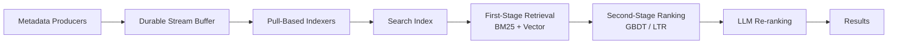

# Data Catalog Search Architecture

A multi-layered engineering architecture for building high-precision search relevance systems over structured data assets (tables, dashboards, ML models). Modern data discovery requires the same caliber of engineering as consumer-grade search engines — ingestion stability, diverse ranking signals, multi-stage ML models, and rigorous evaluation.

## How it works

The architecture has four main layers:

1. **Ingestion** — pull-based streaming from Kafka/Kinesis into search shards with layered index management for real-time freshness ([[pull-based-ingestion]])
2. **Signal extraction** — technical metadata, behavioral patterns, and lineage-based structural authority feed the ranking model ([[search-ranking-signals]])
3. **Multi-stage ranking** — broad retrieval (hybrid lexical + semantic) followed by precise ML-based reordering and LLM re-ranking ([[learning-to-rank]])
4. **Evaluation** — NDCG/MRR/MAP metrics with ground truth from human raters, behavioral logs, and LLM-as-a-judge; operational reliability via canary systems ([[search-evaluation-metrics]])

## Key points
- This is an information retrieval engineering problem, not just a metadata management problem
- Each layer can be improved independently, but they interact — better signals improve ranking, better ingestion improves signal freshness
- LLMs enter at two points: final-stage re-ranking and automated metadata synthesis (filling documentation gaps)
- The Netflix "Data Canary" pattern validates end-to-end correctness by comparing canary vs baseline clusters on live traffic

## Connections
- [[pull-based-ingestion]] — the foundational ingestion layer
- [[search-ranking-signals]] — what features drive the ranking model
- [[learning-to-rank]] — the ML models that order results
- [[search-evaluation-metrics]] — how to measure and trust the system
- [[specialized-knowledge-search]] — the agent-level application that sits on top of these search engineering fundamentals
- [[data-agents]] — data agents depend on robust catalog search for discovery

## Sources
- [[sources/papers/Improving Data Catalog Search Relevance]] — complete architecture and engineering strategies
