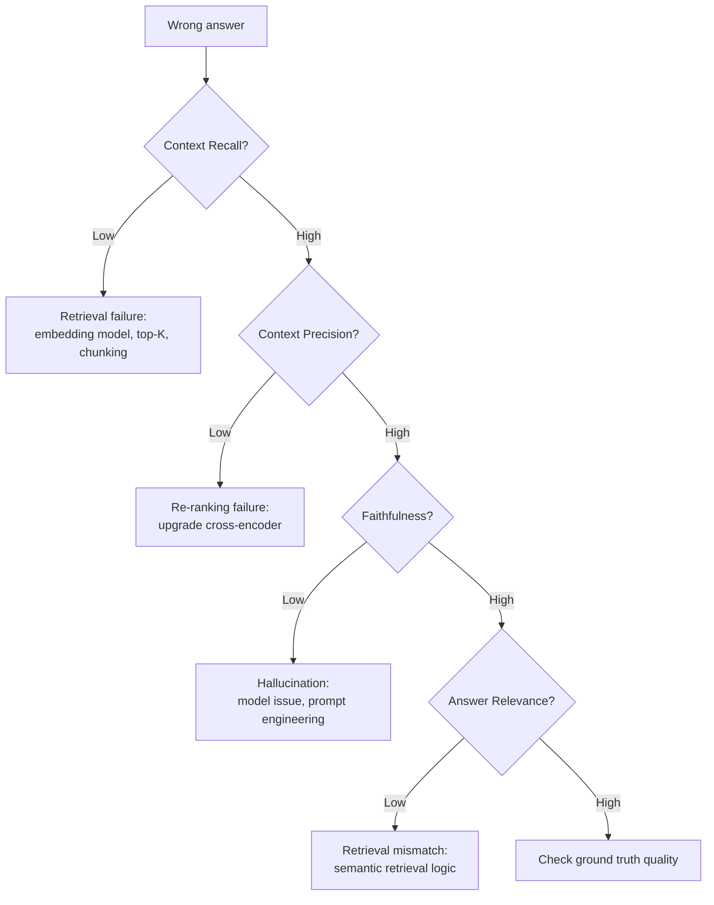

# RAG Evaluation Metrics

A framework for evaluating Retrieval-Augmented Generation systems by explicitly isolating retriever performance from generator performance. When an AI system gives a wrong answer, these metrics diagnose whether the search engine failed to find the right data (retrieval failure) or the LLM ignored/hallucinated despite having correct data (generation failure).

## The Evaluation Paradox

Traditional search metrics evaluate a ranked list. RAG systems produce a synthesized natural language answer. You need metrics that answer two separate questions:
1. Did the retriever fetch the right context?
2. Did the generator use that context correctly?

## Retriever metrics

### Context Precision (rank-aware)
Evaluates whether the most relevant chunks are ranked at the top of the context window passed to the LLM.

- **Why it matters**: LLMs suffer from "lost in the middle" attention degradation. If vital information is buried at the bottom of the context, the model often misses it.
- **Threshold**: 0.7+ for production systems
- **Fix for low scores**: implement a better cross-encoder re-ranker

### Context Recall (set-based, order-agnostic)
Evaluates whether the retrieved payload contains all factual information needed for a complete answer. Requires ground-truth reference answers from human experts.

- **Why it matters**: if the retriever misses key facts, the generator cannot produce a correct answer no matter how capable it is
- **Threshold**: 0.8+ for enterprise systems
- **Fixes for low scores**: increase chunk overlap, upgrade embedding model (check MTEB scores), expand top-K retrieval limit

## Generator metrics

### Faithfulness (Groundedness)
Measures whether every factual claim in the generated response is explicitly supported by the retrieved context. A hallucination occurs when the model uses parametric memory instead of retrieved evidence.

- **Threshold**: 0.8+ general; 0.9+ for finance, law, healthcare
- **High faithfulness + low answer relevance** = retrieval bug (right behavior, wrong content)

### Answer Relevance
Measures whether the generated answer actually addresses the user's query. A response can be perfectly faithful to context but completely irrelevant to the question.

- Example: user asks about "tax software" → system retrieves and summarizes "tax law history" → faithful but irrelevant

## Diagnostic workflow

## Evaluation frameworks (2026)

- **Ragas** — open-source, automated RAG evaluation
- **LangSmith** — LangChain's evaluation and monitoring
- **DeepEval** — LLM-as-a-judge evaluation at scale

All use "LLM-as-a-judge" patterns to automate grading across thousands of test queries.

## Key points
- Never evaluate a RAG system with a single metric — the retriever and generator have different failure modes
- Context Precision failures look like hallucinations (model "can't find" info that's actually present but poorly ranked)
- The order-agnostic nature of Context Recall reflects how agents actually consume information — the whole window at once
- Ground-truth reference answers are required for Context Recall; this is the expensive part of evaluation

## Connections
- [[search-evaluation-metrics]] — the underlying retrieval metrics (NDCG, MRR, MAP) that Context Precision builds upon
- [[precision-recall-tradeoff]] — Context Precision and Context Recall are the RAG-specific instantiation of this tradeoff
- [[data-agents]] — data agents require all four RAG metrics for proper evaluation
- [[learning-to-rank]] — cross-encoder re-rankers are the primary fix for low Context Precision

## Sources
- [[sources/papers/Search Quality Metrics]] — RAG metric definitions, diagnostic framework, evaluation paradox, framework comparison
